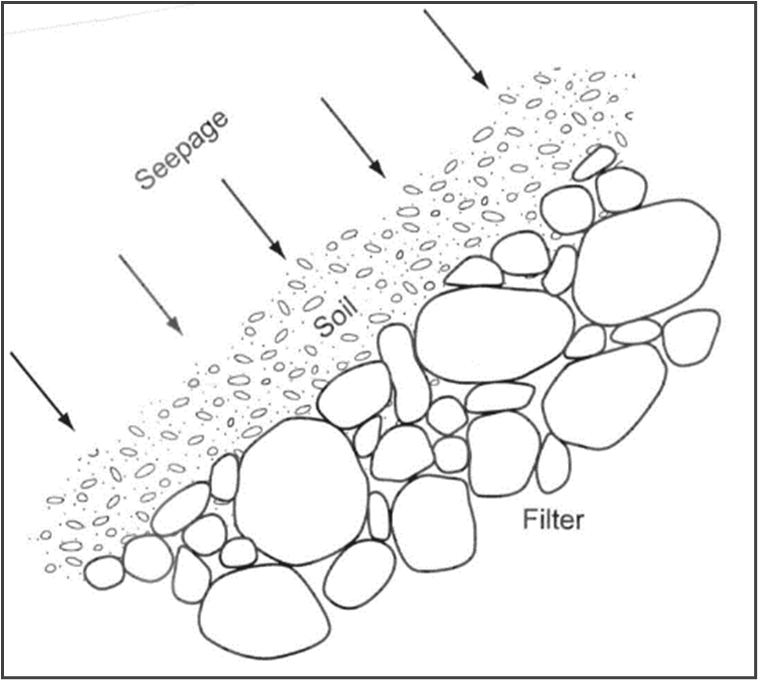

# Background

Testing

Once erosion initiates, it continues unless the eroding forces are reduced or migrating eroded particles are impeded. Continuation is the phase of internal erosion where the relationship of the particle-size distribution between the base soil (core) and the filters or adjacent materials controls whether erosion will continue.

Filters are designed to prevent particle movement from intergranular seepage flow where defects are present in a base soil or seepage water flows through pore spaces of a soil mass in an embankment or foundation. A properly designed filter prevents movement of base soils by seepage forces at a discharge face. The filter supports the discharge face such that bridging between closely spaced contact points prevents any movement of base soil particles into the filter. The filter is also sufficiently coarse to allow seepage water to escape freely. Figure \@ref(fig:figure-8) illustrates how the filter, in contact with the soil discharge face, supports and prevents soil movement.

```{r figure-8, echo=FALSE, fig.align="center", fig.cap="Schematic of filter providing particle retention (FEMA 2011).", out.width="100%"}

```

The Federal Emergency Management Agency (FEMA) (2011) defines a filter as a soil gradation that meets both particle retention and drainage criteria. The term drain refers to a soil gradation that is typically a second stage to the first-stage filter and conveys larger amounts of seepage. This toolbox assesses the particle retention and permeability criteria of filters to inform the likelihood of continuation of erosion. The procedures for evaluating particle retention can be for single-stage and multi-stage filters. For multi-stage filters, repeat the procedure for each zone boundary progressing from the finest to the coarsest-grained filter material.

In their published literature, Terzaghi and Sherard used a lowercase “d” to represent the particle size (diameter) of the base soil and an uppercase “D” for the particle size (diameter) of the filter material. This nomenclature is still commonly used but can be confusing when designing or evaluating two-stage filters since the filter from the first stage becomes the base for the second stage. Therefore, the toolbox uses the following nomenclature:

- *D~XX~Y*, where *D* = particle size (diameter)

- *XX* = percentage passing by weight of particles finer than *D*

- *Y* = material designation (either *B* = base, *F* = first-stage filter, *E* = second-stage envelope, or other drainage element).