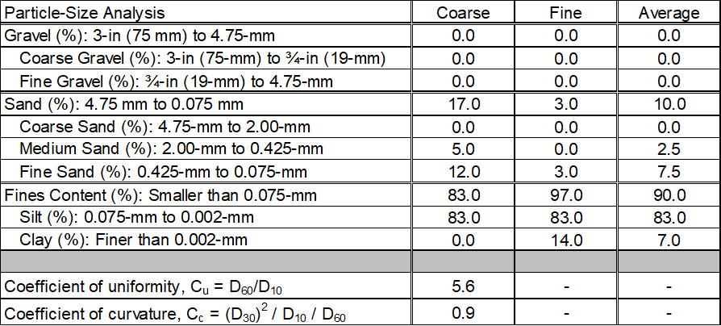

# Filter Gradation

This worksheet performs a particle-size analysis of the filter material.

## Filter Gradation

The input includes sieve size (inches or sieve number), particle size (mm) for hydrometer analysis, and percent finer (by weight) for representative coarse and fine gradations of the filter material.

Use the drop-down list to select the sieve size that defines the gradation of the filter material. Coarse sieve designations range from 12 inches to 0.25 inch, and standard sieve designations range from No. 3½ to No. 200. The particle size (D) in millimeters is automatically populated if a sieve size is selected. If a hydrometer (sedimentation) analysis was performed on the fine-grained portion of the filter material (i.e., passing the No. 200 sieve), select “Hydrometer” from the drop-down list for sieve size, and input user specified particle sizes. Particle sizes from sieve or hydrometer analysis must be in descending order.

The user-specified percent finer (by weight) for the filter material gradation (F) is the percentage of material passing each sieve size or percentage of particles finer than the diameter given by Stokes’ Law for hydrometer analysis. The input must be a decimal number consisting of a whole number and a fractional part (e.g., 100.0 for 100.0 percent passing, 25.5 for 25.5 percent passing). Cells that do not apply or do not require user-specified input have a gray background. Figure \@ref(fig:figure-9) is an example of the gradation input.

```{r figure-9, echo=FALSE, fig.align="center", fig.cap="Filter Gradation worksheet: Gradation input.", out.width="100%"}
knitr::include_graphics("images/figure9.png")
```

Figure \@ref(fig:figure-10) is an example of the summary of the particle-size analysis for the user-specified gradations. The gravel percentage (including coarse and fine gravel percentages), sand percentage (including coarse, medium, and fine sand percentages), fines content (FC) (including estimated silt and clay percentages), coefficient of uniformity (Cu) and coefficient of curvature (Cc) for the coarsest and finest filter material are calculated according to the Unified Soil Classification System (American Society of Testing and Materials [ASTM] D2487). An average percentage is also calculated.

The coefficient of uniformity (*C<sub>u</sub>*) is calculated as:

\begin{equation}
    C_u = \frac{D_{60}}{D_{10}}
    (\#eq:equation-1)
\end{equation}

where:

> *D<sub>10</sub>* = particle-size diameter corresponding to 10 percent passing on the cumulative particle-size distribution curve
> *D<sub>60</sub>* = particle-size diameter corresponding to 60 percent passing on the cumulative particle-size distribution curve

The coefficient of curvature (*C<sub>c</sub>*) is calculated as:

\begin{equation}
    C_c = \frac{(D_{30})^2}{D_{10} D_{60}}
    (\#eq:equation-2)
\end{equation}

where: 

> *D<sub>30</sub>* = particle-size diameter corresponding to 30 percent passing on the cumulative particle-size distribution curve

If a gradation does not specify the particle size corresponding to 10 percent passing, 30 percent passing, or 60 percent passing, *C<sub>u</sub>* and *C<sub>c</sub>* are not calculated.

```{r figure-10, echo=FALSE, fig.align="center", fig.cap="Filter gradation worksheet: Summary of particle-size analysis.", out.width="100%"}

```