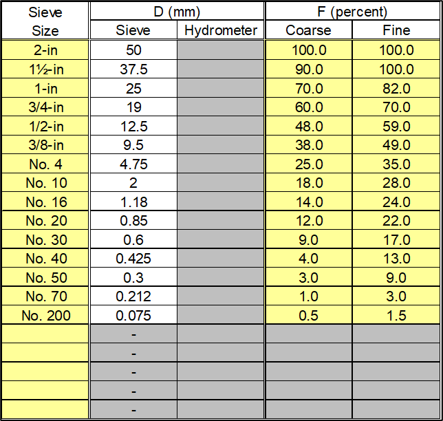

# Filter Gradation

This worksheet performs a particle-size analysis of the filter material.

## Filter Gradation

The input includes sieve size (inches or sieve number), particle size (mm) for hydrometer analysis, and percent finer (by weight) for representative coarse and fine gradations of the filter material.

Use the drop-down list to select the sieve size that defines the gradation of the filter material. Coarse sieve designations range from 12 inches to 0.25 inch, and standard sieve designations range from No. 3½ to No. 200. The particle size (D) in millimeters is automatically populated if a sieve size is selected. If a hydrometer (sedimentation) analysis was performed on the fine-grained portion of the filter material (i.e., passing the No. 200 sieve), select “Hydrometer” from the drop-down list for sieve size, and input user specified particle sizes. Particle sizes from sieve or hydrometer analysis must be in descending order.

The user-specified percent finer (by weight) for the filter material gradation (F) is the percentage of material passing each sieve size or percentage of particles finer than the diameter given by Stokes’ Law for hydrometer analysis. The input must be a decimal number consisting of a whole number and a fractional part (e.g., 100.0 for 100.0 percent passing, 25.5 for 25.5 percent passing). Cells that do not apply or do not require user-specified input have a gray background. Figure \@ref(fig:figure-9) is an example of the gradation input.

```{r figure-9, echo=FALSE, fig.align="center", fig.cap="Filter Gradation worksheet: Gradation input.", out.width="100%"}

```