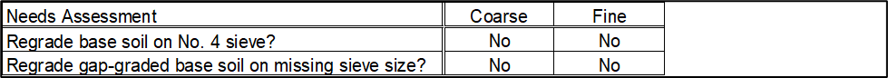
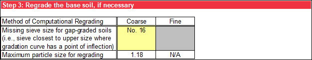
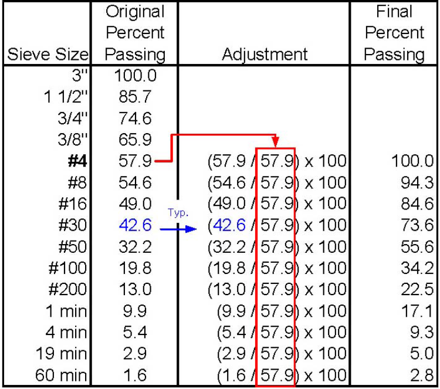
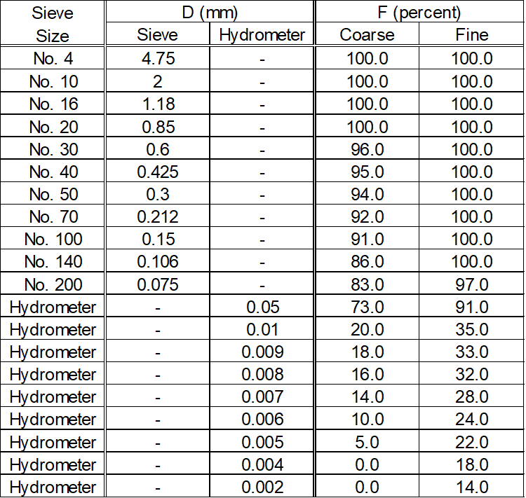

# Base Gradation

This worksheet performs a particle-size analysis of the original base soil gradation and, if necessary, the regraded base soil.

## Base Soil Gradation

In step 1, the gradation input and particle-size analysis for teh base soil is the same as the filter material detailed.

## Needs Assessment for Regrading

Sherard and Dunnigan [@cite-Sherard1989] developed the concept of a mathematical adjustment or regrading the base soil to a maximum particle size of 4.75 mm (100 percent passing the No. 4 sieve) for soils with gravels and to correct for broadly graded soils. Broadly graded soils can be internally unstable, where the finer particles can move internally within a matrix of larger particles, and regrading corrects for this phenomenon. Permitting the inclusion of gravel within a base soil gradation leads to a large *D<sub>85</sub>B* and subsequently, a large *D<sub>15</sub>F*. Since gravel particles do not have any particle retention capability in broadly graded soils, the resulting filter gradation is too coarse to provide particle retention of the finer fraction of the base soil.

Step 2 performs a needs assessment for regrading the base soil using a series of questions about various base soil characteristics. Use the drop-down list to assess whether the base soil is gap graded, because a visual examination of the shape of the gradation curve and judgment are required. Base soils containing particles larger than the No. 4 sieve, having *FC* less than 15 percent, and being broadly graded are evaluated based on the particle-size analysis in step 1. Broadly graded soils are defined by [@cite-ASTM2487] as having 1 ≤ *C<sub>c</sub>* ≤ 3 and having *C<sub>u</sub>* ≥ 6 for sands or *C<sub>u</sub>* ≥ 4 for gravels. The evaluation of broadly graded soils may be inconclusive if *C<sub>u</sub>* and *C<sub>c</sub>* are not calculated because *D<sub>10</sub>B* or *D<sub>30</sub>B* are not available, for example. For that scenario, manually extrapolate the gradation curve and externally calculate *C<sub>u</sub>* and *C<sub>c</sub>*. Use the drop-down list for the final assessment for whether the base soil is broadly graded. Figure \@ref(fig:figure-12) is an example of the responses to the questions about conditions informing regrading.

```{r figure-12, echo=FALSE, fig.align="center", fig.cap="Step 2 of Base Gradation worksheet: Conditions informing regrading.", out.width="100%"}
knitr::include_graphics("images/figure12.png")
```

Based on the responses to the questions, the needs assessment evaluation sequence is as follows:

1. If the base soil is gap-graded, it must be regraded on the particle size (closest sieve) that is missing.

2.	If the base soil does not contain particles larger than the No. 4 sieve, regrading is not necessary.

3.	If the base soil contains particles larger than the No. 4 sieve, it must be regraded to 100 percent passing the No. 4 sieve, unless it has *FC* less than 15 percent and is not broadly graded.

Figure \@ref(fig:figure-13) is an example of the summary of the needs assessment results.

```{r figure-13, echo=FALSE, fig.align="center", fig.cap="Step 2 of Base Gradation worksheet: Needs assessment for regrading.", out.width="100%"}

```

## Base Soil Gradation After Regrading

In step 3, the method of computational regrading is based on the results in step 2. If regrading is not required, “N/A” displays. If the base soil is gap-graded, use the drop-down list to select the sieve size closest to the upper size where the gradation curve has a point of inflection, and the corresponding particle size displays. Cells that do not apply have a gray background. A particle size of 4.75 mm displays if regrading on the No. 4 sieve is required. Figure \@ref(fig:figure-14) through Figure \@ref(fig:figure-16) illustrate the three possible scenarios.

```{r figure-14, echo=FALSE, fig.align="center", fig.cap="Step 3 of Base Gradation worksheet: No regrading.", out.width="100%"}
knitr::include_graphics("images/figure14.png")
```

```{r figure-15, echo=FALSE, fig.align="center", fig.cap="Step 3 of Base Gradation worksheet: Regrading on the No. 4 sieve.", out.width="100%"}
knitr::include_graphics("images/figure15.png")
```

```{r figure-16, echo=FALSE, fig.align="center", fig.cap="Step 3 of Base Gradation worksheet: Regrading on missing sieve size for gap-graded soils.", out.width="100%"}

```

If regrading is required, the base soil is regraded to the appropriate maximum particle size. For Regrade the base soil to 100 percent passing the No. 4 sieve, the percentage passing each sieve size of the original base soil is divided by the percentage passing the No. 4 sieve of the original base soil, multiplied by 100 percent, as shown in Figure \@ref(fig:figure-17). The procedure for regrading a gap graded base soil is the same, except to regrade on the particle size that is missing instead of the No. 4 sieve.

```{r figure-17, echo=FALSE, fig.align="center", fig.cap="Example regrading calculation on No. 4 sieve. [@cite-DS13]", out.width="55%"}

```

Figure \@ref(fig:figure-18) is an example gradation of the regraded base soil. If regrading is not required, the gradation from step 1 displays and is used for calculations on subsequent worksheets where gradations after regrading are required input. The summary of the particle-size analysis for the regraded base soil is the same as the filter material, except *C<sub>u</sub>* and *C<sub>c</sub>* are not calculated for the regraded base soil.

```{r figure-18, echo=FALSE, fig.align="center", fig.cap="Step 3 of Base Gradation worksheet: Regraded base soil gradation.", out.width="75%"}

```