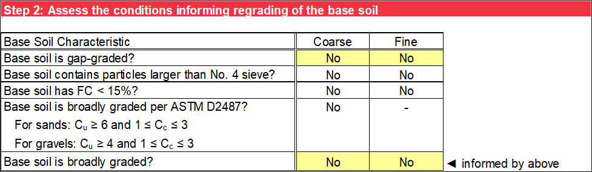

# Base Gradation

This worksheet performs a particle-size analysis of the original base soil gradation and, if necessary, the regraded base soil.

## Base Soil Gradation

In step 1, the gradation input and particle-size analysis for teh base soil is the same as the filter material detailed.

## Needs Assessment for Regrading

Sherard and Dunnigan (1989) developed the concept of a mathematical adjustment or regrading the base soil to a maximum particle size of 4.75 mm (100 percent passing the No. 4 sieve) for soils with gravels and to correct for broadly graded soils. Broadly graded soils can be internally unstable, where the finer particles can move internally within a matrix of larger particles, and regrading corrects for this phenomenon. Permitting the inclusion of gravel within a base soil gradation leads to a large *D<sub>85</sub>B* and subsequently, a large *D<sub>15</sub>F*. Since gravel particles do not have any particle retention capability in broadly graded soils, the resulting filter gradation is too coarse to provide particle retention of the finer fraction of the base soil.

Step 2 performs a needs assessment for regrading the base soil using a series of questions about various base soil characteristics. Use the drop-down list to assess whether the base soil is gap graded, because a visual examination of the shape of the gradation curve and judgment are required. Base soils containing particles larger than the No. 4 sieve, having *FC* less than 15 percent, and being broadly graded are evaluated based on the particle-size analysis in step 1. Broadly graded soils are defined by ASTM D2487 as having 1 ≤ *C<sub>c</sub>* ≤ 3 and having *C<sub>u</sub>* ≥ 6 for sands or *C<sub>u</sub>* ≥ 4 for gravels. The evaluation of broadly graded soils may be inconclusive if *C<sub>u</sub>* and *C<sub>c</sub>* are not calculated because *D<sub>10</sub>B* or *D<sub>30</sub>B* are not available, for example. For that scenario, manually extrapolate the gradation curve and externally calculate *C<sub>u</sub>* and *C<sub>c</sub>*. Use the drop-down list for the final assessment for whether the base soil is broadly graded. Figure \@ref(fig:figure-12) is an example of the responses to the questions about conditions informing regrading.

```{r figure-12, echo=FALSE, fig.align="center", fig.cap="Step 2 of Base Gradation worksheet: Conditions informing regrading.", out.width="100%"}

```

Based on the responses to the questions, the needs assessment evaluation sequence is as follows:

1. If the base soil is gap-graded, it must be regraded on the particle size (closest sieve) that is missing.

2.	If the base soil does not contain particles larger than the No. 4 sieve, regrading is not necessary.

3.	If the base soil contains particles larger than the No. 4 sieve, it must be regraded to 100 percent passing the No. 4 sieve, unless it has *FC* less than 15 percent and is not broadly graded.

Figure \@ref(fig:figure-13) is an example of the summary of the needs assessment results.

```{r figure-13, echo=FALSE, fig.align="center", fig.cap="Step 2 of Base Gradation worksheet: Needs assessment for regrading.", out.width="100%"}

```