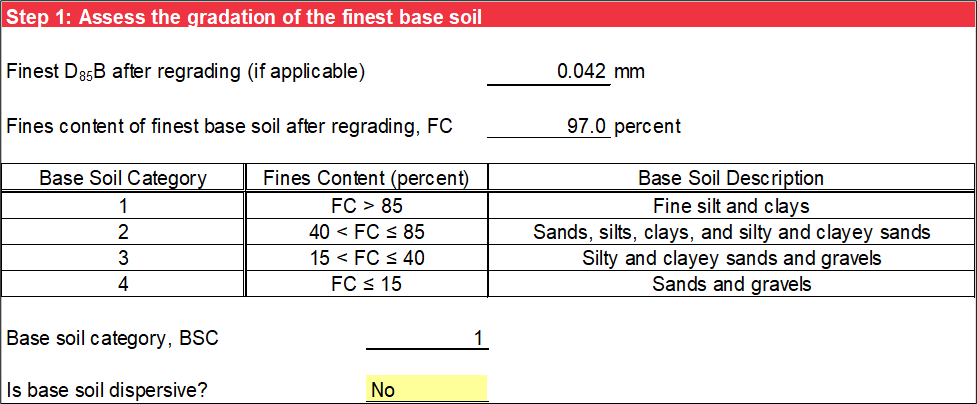
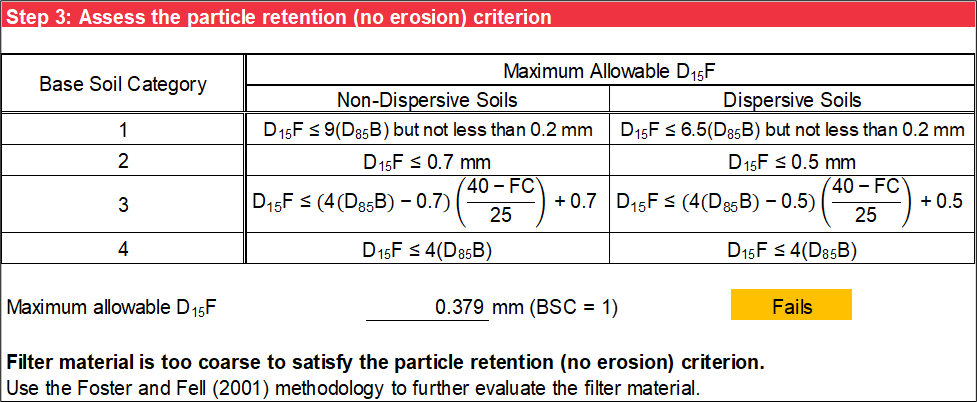
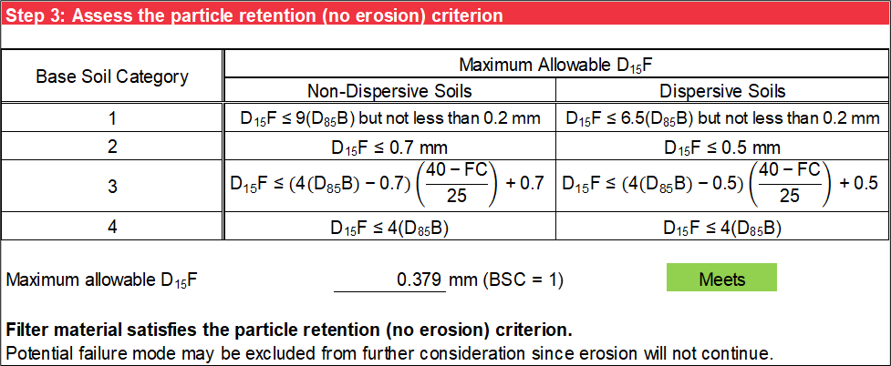

# Design for Particle Retention

Modern filter design criteria for particle retention are based on providing a no-erosion condition. The no erosion condition occurs when a filter material is sufficiently fine to seal with no erosion, or practically no erosion, of the base material. This worksheet assesses the particle retention criterion for no erosion and helps to screen potential failure modes if no erosion is expected. If a filter fails the no-erosion screening, the other erosion boundaries using the Foster and Fell [@cite-FosterandFell2001] method described in section 8 are evaluated to assess how much erosion is required for self-filtering to occur and whether it can be tolerated.

## Base Soil Characterization

Step 1 characterizes the base soil. The fines content (FC), or percent passing the No. 200 sieve size by weight, of the finest base soil after regrading (if applicable) is obtained from the Base Gradation worksheet, where it is interpolated using a logarithmic scale for particle size and linear scale for percent passing. The base soil category (BSC) is assigned based on the FC of the finest base soil after regrading (if applicable). Use the drop-down list to select whether the base soil is non-dispersive or dispersive. Figure \@ref(fig:figure-19) is an example of step 1.

```{r figure-19, echo=FALSE, fig.align="center", fig.cap="Step 1 of Particle Retention worksheet: Base soil characterization.", out.width="100%"}

```

## Filter Material Characterization

Step 2 characterizes the filter material. The coarsest *D<sub>15</sub>F* is obtained from the Filter Gradation worksheet, where it is interpolated using a logarithmic scale for particle size and linear scale for percent passing. Figure \@ref(fig:figure-20) is an example of step 2.

```{r figure-20, echo=FALSE, fig.align="center", fig.cap="Step 2 of Particle Retention worksheet: Filter material characterization.", out.width="100%"}

```

## Particle Retention Criterion

Sherard et al. [@cite-Sherard1984] and Foster and Fell [@cite-FosterandFell2001] show that the measurable property of the filter that best defines its particle retention capability is the *D<sub>15</sub>* of the filter (*D<sub>15</sub>F*). Research also shows that the correlation between *D<sub>15</sub>F* and the *d<sub>85</sub>* of the base soil being protected by the filter (*D<sub>85</sub>B*) provides the best correlation for successful particle retention.

Sherard and Dunnigan [@cite-Sherard1985] developed the No-Erosion Filter (NEF) test to find the ratio of *D<sub>15</sub>F* and *D<sub>85</sub>B* that establishes a no-erosion condition for non-dispersive base soils. Additional research by Foster and Fell [@cite-FosterandFell2001] at the University of New South Wales (UNSW) helped in developing the no erosion condition for dispersive base soils. The results of the NEF and UNSW tests were used to develop the modern filter design criteria for particle retention in FEMA [@cite-FEMA2011].

Step 3 evaluates the no-erosion particle retention criterion by comparing the coarsest *D<sub>15</sub>F* to the maximum allowable *D<sub>15</sub>F* based on the BSC and knowing whether the base soil is non-dispersive or dispersive. The criteria are a function of *D<sub>85</sub>B* and *FC*, as shown in Figure \@ref(fig:figure-21) and Figure \@ref(fig:figure-22). If the coarsest *D<sub>15</sub>F* is less than or equal to the maximum allowable *D<sub>15</sub>F*, “Meets” displays next to the calculation. If the criterion is not met, “Fails” displays next to the calculation. A green background displays if the particle retention criterion is met, and an orange background displays if the particle retention criterion is not met.

Based on the particle retention criterion, a statement appears after the calculations indicating if the filter material satisfies the no-erosion particle retention criterion or is too coarse to satisfy the no-erosion particle retention criterion. If the particle retention criterion for no erosion is not met, use the Foster and Fell [@cite-FosterandFell2001] method to further evaluate the effectiveness of the filter material for particle retention. Figure \@ref(fig:figure-21) and Figure \@ref(fig:figure-22) are examples of the two possible scenarios for the no-erosion particle retention criterion.

```{r figure-21, echo=FALSE, fig.align="center", fig.cap="Step 3 of Particle Retention worksheet: Particle retention criterion not met.", out.width="100%"}

```

```{r figure-22, echo=FALSE, fig.align="center", fig.cap="Step 3 of Particle Retention worksheet: Particle retention criterion met.", out.width="100%"}

```