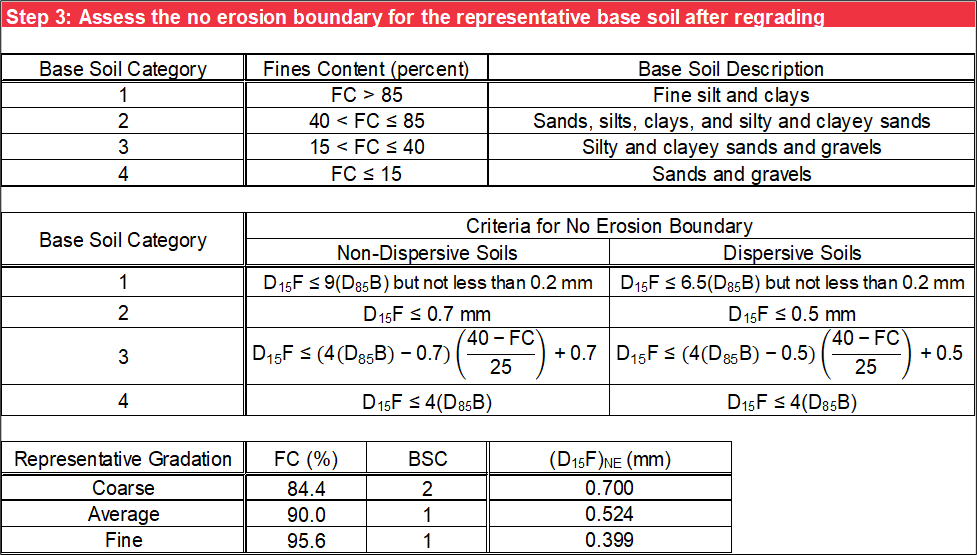
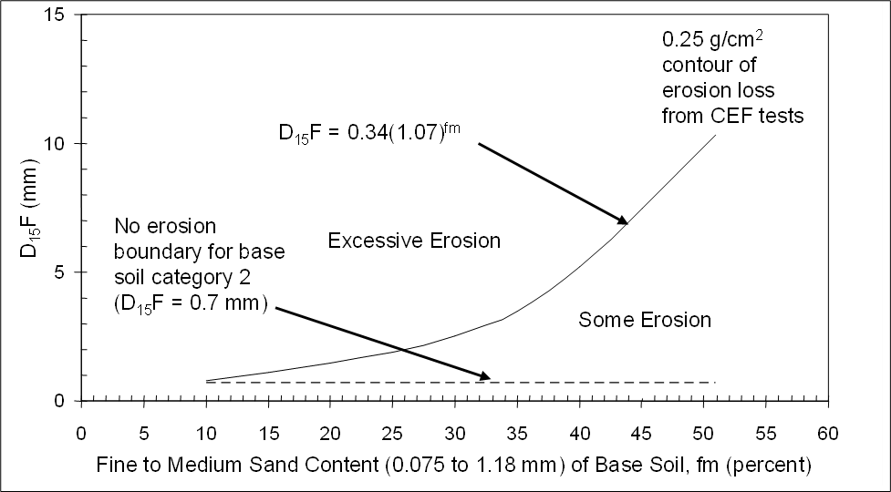
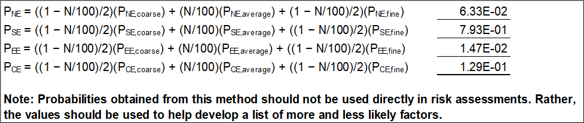

# Foster and Fell

Many existing embankment dams have filter or transition zones coarser than required by modern filter design criteria. Foster and Fell (2001) indicated that filter materials could be coarser than those resulting from the no-erosion particle retention criterion but still prevent continuous erosion of the base material. For risk assessments of existing embankment dams, it is necessary to evaluate the likelihood of continuation of erosion when such filters are present.

Foster and Fell (2001) developed the continuing erosion filter (CEF) test by modifying the NEF test to evaluate filter performance in terms of how much erosion is required to seal the filter material. The concept of erosion boundaries was developed to describe the filter behavior.

- No-erosion (NE) condition occurs when the filter material seals with no erosion or very little erosion of the base material. The increase in leakage flows is so small that it is likely undetectable. Filters designed and constructed according to modern filter design criteria satisfy the NE condition as described in section 7.

- Some erosion (SE) condition occurs when “some” erosion of the base soil occurs, but the filter quickly seals after particles of the base material clog the surface of the filter.

- Excessive erosion (EE) condition occurs when “excessive” erosion of the base soil occurs, allowing large increases in leakage flow before the filter seals. The extent of erosion is sufficient to damage the embankment.

- Continuing erosion (CE) occurs when the filter is too coarse to allow the eroded base materials to seal the filter, allowing unrestricted or continuous erosion of the base soil and leakage flows.

Figure \@ref(fig:figure-23) conceptually shows these erosion boundaries from CEF test behavior.

```{r figure-23, echo=FALSE, fig.align="center", fig.cap="Conceptual erosion boundaries of continuing erosion filter test behavior (adapted from Foster and Fell 2001).", out.width="100%"}
knitr::include_graphics("images/figure23.png")
```

Applying these methods correctly requires understanding the context from which each method was developed, as laboratory test conditions may vary from field conditions. The filter evaluation relies heavily on the research of Foster and Fell (2001) to determine NE, SE, EE, and CE boundaries for the base soil. These erosion conditions were derived from CEF tests, which consisted of a vertically downward flow regime using very high water pressures (i.e., full tap pressure of 300 kPa) and a preformed hole. Therefore, the results are likely conservative.

## Base Soil Characterization

Step 1 characterizes the base soil after regrading (if applicable). Due to the large variability of base soil gradations that may be encountered in practice, gradation test data may include statistical results that are not representative of in situ conditions. FEMA (2011) discusses selecting the representative base soil gradation, and the RMC Soil Classification Toolbox can be used to plot all base soil gradations to help the evaluation. While the range or envelope of base soil gradations are input on the Base Gradation worksheet, use the drop-down list to specify the percentage (*N*) of those gradations considered representative of the base soil gradation for subsequent calculations.

For each input sieve size, the range or envelope of the corresponding percent finer is proportioned to obtain the finer (100% − *N*) ∕ 2 of the base soil gradations and the coarser (100% − *N*) ∕ 2 of the base soil gradations. The average gradation is also obtained for each input sieve size for the range or envelope of the corresponding percent finer. Alternatively, input the representative base soil gradation directly on the Base Gradation worksheet and use a value of 100 percent for *N*, so no further adjustment is made. Fell et al. (2008) recommended selecting representative gradations of the regraded base soil (if applicable), which are indicative of the finer 5 percent of base soil gradations, average gradation, and coarser 5 percent of base soil gradations (i.e., the representative base soil gradation represents *N* = 90 percent of all gradation tests). Selecting the representative base soil gradation is illustrated in Figure \@ref(fig:figure-24).

```{r figure-24, echo=FALSE, fig.align="center", fig.cap="Example of representative gradation curves.", out.width="100%"}
knitr::include_graphics("images/figure24.png")
```

The *D<sub>95</sub>B*, *D<sub>90</sub>B*, *D<sub>85</sub>B*, *FC*, and fine-to-medium sand content (*fm*) of the representative base soil gradation are interpolated using a logarithmic scale for particle size and linear scale for percent passing. For the Foster and Fell (2001) method, the fine-to-medium sand content of the base soil is defined as the percentage between 1.18 mm and 0.075 mm, whereas ASTM D2487 defines fine-to-medium sand as the percentage of soil particles between 2.00 mm and 0.075 mm. Use the drop-down list to select whether the base soil is non-dispersive or dispersive. Figure \@ref(fig:figure-25) is an example of step 1.

```{r figure-25, echo=FALSE, fig.align="center", fig.cap="Step 1 of Foster and Fell worksheet: Base soil characterization.", out.width="100%"}
knitr::include_graphics("images/figure25.png")
```

## Filter Material Characterization

Step 2 characterizes the filter material. The range of *D<sub>95</sub>B* is obtained from the Filter Gradation worksheet, where it is interpolated using a logarithmic scale for particle size and linear scale for percent passing. Figure \@ref(fig:figure-26) is an example of step 2.

```{r figure-26, echo=FALSE, fig.align="center", fig.cap="Step 2 of Foster and Fell worksheet: Filter material characterization.", out.width="100%"}

```

## No-Erosion Boundary

Step 3 evaluates the no-erosion boundary [*(D<sub>15</sub>F)<sub>NE</sub>*] for the representative base soil gradations after regrading (if applicable), based on the BSC and whether the base soil is non-dispersive or dispersive. The criteria are the same as the no-erosion criteria on the Particle Retention worksheet and are a function of *D<sub>85</sub>B* and *FC* as shown in Figure \@ref(fig:figure-27).

```{r figure-27, echo=FALSE, fig.align="center", fig.cap="Step 3 of Foster and Fell worksheet: No-erosion boundary.", out.width="100%"}

```

## Continuing Erosion Boundary

Step 4 evaluates the continuing erosion boundary [*(D<sub>15</sub>F)<sub>CE</sub>*] from Foster and Fell (2001) for the representative base soil gradations after regrading (if applicable), based on *D<sub>95</sub>B* using the criterion shown in Figure \@ref(fig:figure-28). If a continuing erosion condition is met for the representative base soil gradation, the other erosion boundary is not assessed.

```{r figure-28, echo=FALSE, fig.align="center", fig.cap="Step 4 of Foster and Fell worksheet: Continuing erosion boundary.", out.width="100%"}
knitr::include_graphics("images/figure28.png")
```

## Excessive Erosion Boundary

Step 5 evaluates the excessive erosion boundary [*(D<sub>15</sub>F)<sub>EE</sub>*] from Foster and Fell (2001) for the representative base soil gradations after regrading (if applicable), based on *D<sub>95</sub>B*, *D<sub>90</sub>B*, *D<sub>85</sub>B*, *FC*, and *fm* and whether the base soil is non-dispersive or dispersive, using the criteria shown in Figure \@ref(fig:figure-29). The criterion for *D<sub>95</sub>B* greater than 2 mm and *FC* greater than 35 percent was obtained by a curve fit to the 0.25-g/cm2 contour of erosion loss from CEF tests from Foster and Fell (2001), as recommended by Fell et al. (2008) (see Figure \@ref(fig:figure-30)).

```{r figure-29, echo=FALSE, fig.align="center", fig.cap="Excessive erosion boundary (adapted from Fell et al. 2008).", out.width="100%"}

```

```{r figure-30, echo=FALSE, fig.align="center", fig.cap="Step 4 of Foster and Fell worksheet: Excessive erosion boundary.", out.width="100%"}
knitr::include_graphics("images/figure30.png")
```

## Likelihood of Erosion

Step 6 compares the erosion boundaries for the representative base soil gradation after regrading (if applicable) against the range of *D<sub>15</sub>F* (example provided in Figure \@ref(fig:figure-31)). The ranges of the erosion boundaries for the coarse base soil gradation, average base soil gradation, and fine base soil gradation display as green, blue, and red horizontal lines, respectively. The range for the CE and NE categories extends infinitely beyond their respective boundaries. The erosion boundaries for each representative base soil gradation display as short vertical lines of the same color as the horizontal lines, and the erosion categories are labeled between the boundaries. The range of *D<sub>15</sub>F* displays as vertical black lines that intersect these erosion categories.

The proportions of the filter material gradation that fall into the CE, EE, and SE categories are calculated for each of the representative base soil gradations after regrading (if applicable) and are summarized in a table. It is possible for the EE boundary to be the same as the CE boundary. For those scenarios, there is no proportion for EE, and only SE displays. The sum of the proportions must be 100 percent. Fell et al. (2008) recommended estimating the proportions for CE, EE, and SE and then calculating the proportion of the filter material gradation finer than the NE category as in the following equations.

\begin{equation}
    {P_NE,coarse} = 1 - {P_CE,coarse} - {P_EE,coarse} - {P_SE,coarse}
    (\#eq:equation-3)
\end{equation}

\begin{equation}
    {P_NE,average} = 1 - {P_CE,average} - {P_EE,average} - {P_SE,average}
    (\#eq:equation-4)
\end{equation}

\begin{equation}
    {P_NE,fine} = 1 - {P_CE,fine} - {P_EE,fine} - {P_SE,fine}
    (\#eq:equation-5)
\end{equation}

where:

> *P,<sub>NE</sub>* = proportion of the filter material gradation finer than the NE category  
> *P,<sub>SE</sub>* = proportion of the filter material gradation within the SE category  
> *P,<sub>EE</sub>* = proportion of the filter material gradation within the EE category  
> *P,<sub>CE</sub>* = proportion of the filter material gradation coarser than the NE category

```{r figure-31, echo=FALSE, fig.align="center", fig.cap="Step 6 of Foster and Fell worksheet: Erosion boundaries for representative base soil gradation.", out.width="100%"}
knitr::include_graphics("images/figure31.png")
```

***This section of the technical manual formerly contained instructions for using the guidance in Fell et al. (2008) to estimate the probability of continuing erosion for gradations finer than the continuing erosion boundary. The Risk Management Center no longer suggests that this approach be used in risk analyses.***

The probabilities of NE, SE, EE, and CE are estimated by weighting the proportions of NE, SE, EE, and CE for each representative base soil gradation by the percentage of the representative base soil gradation (i.e., the sum of the products of the percentage of each representative base soil gradation and the proportions of NE, SE, EE, and CE for each representative base soil gradation) as shown in Figure \@ref(fig:figure-32).

```{r figure-32, echo=FALSE, fig.align="center", fig.cap="Step 6 of Foster and Fell worksheet: Probability of each erosion condition.", out.width="100%"}

```