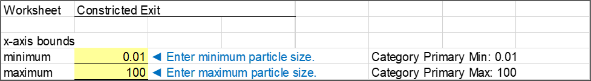

# Constricted Exit

Constricted, or non-erodible, exits consist of open joints, defects, or cracks in conduits, drains, walls, or rock. For erosion to continue, the opening size must be sufficient for the adjacent base soil particles to pass through it. This worksheet assesses the joint/defect opening size that allows erosion to continue.

## Base Soil Characterization

Step 1 characterizes the base material. The range of *D<sub>95</sub>B* of the base soil adjacent to the open joint, defect, or crack is obtained from the Base Gradation worksheet, where the finest and coarsest *D<sub>95</sub>B* of the adjacent base soil after regrading (if applicable) are interpolated using a logarithmic scale for particle size and linear scale for percent passing. Figure \@ref(fig:figure-34) is an example of step 1.

```{r figure-34, echo=FALSE, fig.align="center", fig.cap="Step 1 of Constricted Exit worksheet: Base soil characterization.", out.width="100%"}
knitr::include_graphics("images/figure34.png")
```

## Open Joint, Defect, or Crack Characterization

Step 2 characterizes the open joint, defect, or crack, and the joint/defect opening size (*JOS*) is input. The user-specified *JOS* and range of *D<sub>95</sub>B* of the adjacent base soil are portrayed on a cumulative particle-size plot to visually compare their relative sizes, as shown in Figure \@ref(fig:figure-35). The y-axis (percent passing by weight) is truncated at 90 percent passing since only the particle-size diameter corresponding to 95 percent passing is used in the evaluation. The size of the open joint, defect, or crack is depicted with a vertical back line at the *JOS* and horizontal lines that extend infinitely smaller since a logarithmic scale is used. The range of *D<sub>95</sub>B* displays as a red horizontal line.

```{r figure-35, echo=FALSE, fig.align="center", fig.cap="Step 2 of Constricted Exit worksheet: Effective opening size.", out.width="100%"}
knitr::include_graphics("images/figure35.png")
```

The plot options for this chart are illustrated in Figure \@ref(fig:figure-36). The minimum and maximum values for the x-axis (particle size) are user-specified.

```{r figure-36, echo=FALSE, fig.align="center", fig.cap="Step 2 of Constricted Exit worksheet: Plot options.", out.width="100%"}

```

## Likelihood of Continuation

Step 3 estimates the probability of continuing erosion (*P<sub>CE</sub>*) using the procedure of Fell and Foster (2023). The *JOS* that allows continuing erosion of the adjacent base soil (*JOS<sub>CE</sub>*) is between *D<sub>95</sub>B* and *3D<sub>95</sub>B*. Sherard et al. (1984) concluded that uniform filters act similar to laboratory sieves with an opening sieve size approximately equal to *D<sub>15</sub>F* ∕ 9. The *D<sub>95</sub>B* criterion assumes the Foster and Fell (2001) continuing erosion criterion (see section 8.4) applies to erosion into an open joint, defect, or crack, and the crack width is equivalent to the filter opening size of the voids between the particles in a filter. The *3D<sub>95</sub>B* criterion is based on the *JOS* for cement grout to penetrate and flow along the opening of joints in rock.

The probabilities shown in Table 1 considered these limits. In the table, *P<sub>CE</sub>* is a function the ratio of the *JOS* to the finest *D<sub>95</sub>B* of the adjacent base soil after regrading (if applicable). If *JOS* ∕ *D<sub>95</sub>B* is less than 0.4, zero is displayed. If *JOS* ∕ *D<sub>95</sub>B* is greater than or equal to 0.4 and less than 0.5, “<0.0001” is displayed. Intermediate values between 0.5 and 3.0 are interpolated using a z-variate scale for probability and a linear scale for the ratio *JOS* ∕ *D<sub>95</sub>B*.
