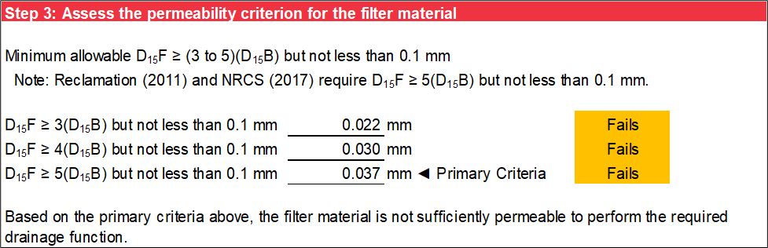
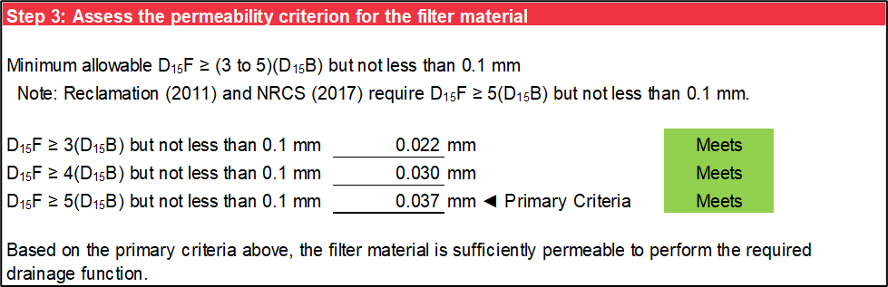

# Permeability

This worksheet assesses whether the filter material meets the drainage criterion for permeability. It requires no user-specified input. Permeability is directly proportional to the square of the effective particle size with all other factors being equal. Typically, the permeability of a filter should be at least 16 to 25 times that of the base material. This criterion is generally met if *D<sub>15</sub>F* is larger than 4 to 5 times *D<sub>15</sub>B*. In some very broadly graded base soils, this requirement may be difficult to meet.

## Base Soil Characterization

Step 1 characterizes the base soil. FEMA (2011) indicates the coarsest *D<sub>15</sub>B* before regrading is used to evaluate permeability requirements. Step 1 obtains the coarsest *D<sub>15</sub>B* before regrading from the Base Gradation worksheet, where it is interpolated using a logarithmic scale for particle size and linear scale for percent passing. Figure \@ref(fig:figure-38) is an example of step 1.

```{r figure-38, echo=FALSE, fig.align="center", fig.cap="Step 1 of Permeability worksheet: Base soil characterization.", out.width="100%"}

```

## Filter Material Characterization

Step 2 characterizes the filter material. The finest *D<sub>15</sub>F* is obtained from the Filter Gradation worksheet, where it is interpolated using a logarithmic scale for particle size and linear scale for percent passing. Figure \@ref(fig:figure-39) is an example of step 2.

```{r figure-39, echo=FALSE, fig.align="center", fig.cap="Step 2 of Permeability worksheet: Filter material characterization.", out.width="100%"}
knitr::include_graphics("images/figure39.png")
```

## Permeability Criterion

The criterion for permeability is that the filter material has a minimum *D<sub>15</sub>F* that is an integer multiplier of the coarsest *D<sub>15</sub>B* before regrading but not less than 0.1 mm. USACE Engineer Manual (EM) 1110-2-1901 [@cite-EM1901] requires a multiplier of 3 to 5. However, USBR [@cite-DS13] and National Resources Conservation Service (NRCS) [@cite-NEH633] require a multiplier of 5, which is considered the primary criterion on this worksheet. The minimum *D<sub>15</sub>F* of the filter material is calculated as in the following equation.

\begin{equation}
    D_{15}F = 5D_{15}B \text{ but not less than 0.1 mm} 
    (\#eq:equation-4)
\end{equation}

where:

> *D<sub>15</sub>F* = particle-size diameter of the filter material corresponding to 15 percent passing on the cumulative particle-size distribution curve  
> *D<sub>15</sub>B* = particle-size diameter of the base soil corresponding to 15 percent passing on the cumulative particle-size distribution curve before regrading

Step 3 evaluates the permeability criterion for integer multipliers ranging from 3 to 5. If the criterion is met, “Meets” displays next to the calculation. If the criterion is not met, “Fails” displays next to the calculation. A green background displays if the criterion is met, and an orange background displays if the criterion is not met. Based on the primary criterion using a multiplier of 5, a statement appears after the set of calculations indicating whether the filter material is sufficiently permeable to perform the required drainage function. Examples of the two possible scenarios for the primary filter criterion are shown in Figure \@ref(fig:figure-40) and Figure \@ref(fig:figure-41).

```{r figure-40, echo=FALSE, fig.align="center", fig.cap="Step 3 of Permeability worksheet: Primary permeability criteria not met.", out.width="100%"}

```

```{r figure-41, echo=FALSE, fig.align="center", fig.cap="Step 3 of Permeability worksheet: Primary permeability criteria met.", out.width="100%"}

```